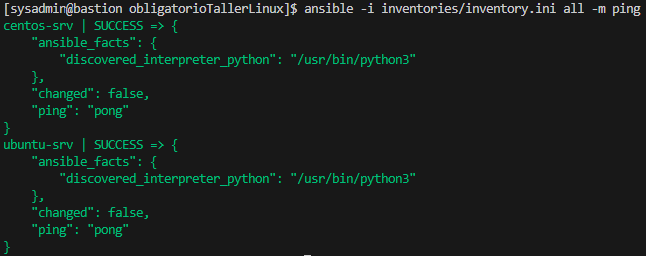
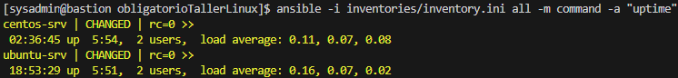
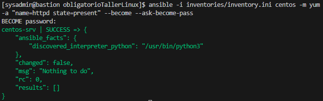
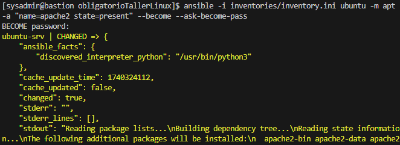
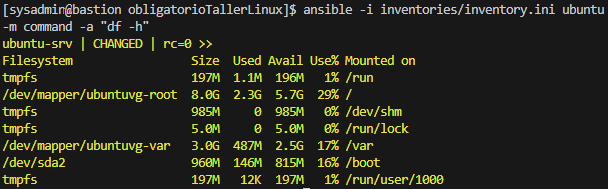
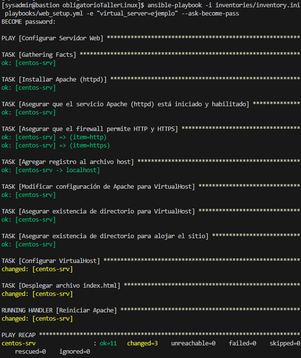
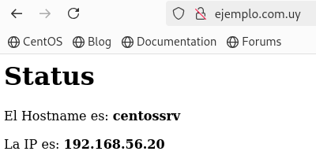
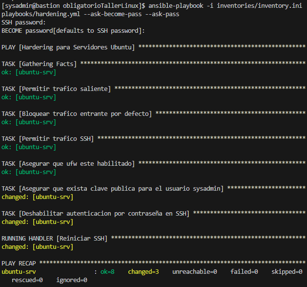

# Documentación del Obligatorio del Taller de servidores Linux

Este documento detalla la implementación del obligatorio del Taller del Servidores Linux. Incluye la ejecución de comandos ad-hoc, playbooks de Ansible y respuestas a preguntas teóricas.

## 1. Inventario de Ansible

El archivo de inventario [`inventories/inventory.ini`](../inventories/inventory.ini) contiene la definición de los servidores y sus respectivos grupos, además de definir la variable ansible_host con la dirección IP de cada servidor.

Asimismo, las variables comunes a todos los servidores Linux están configuradas en [`inventories/group_vars/linux.yml`](../inventories/group_vars/linux.yml), donde se establece la variable ansible_user con el valor sysadmin.

Validación de conectividad con los servidores:
   ```bash
   ansible -i inventories/inventory.ini all -m ping
   ```
Captura de pantalla:



## 2. Ejecución de comandos ad-hoc

### Verificar el tiempo de actividad (uptime) en todos los servidores:

   ```bash
   ansible -i inventories/inventory.ini all -m command -a "uptime"
   ```
Captura de pantalla:



### Instalar Apache en todos los servidores:

Dado que CentOS y Ubuntu usan diferentes gestores de paquetes, se ejecutan dos comandos separados:

   ```bash
   # Para CentOS
   ansible -i inventories/inventory.ini centos -m yum -a "name=httpd state=present" --become --ask-become-pass

   # Para Ubuntu
   ansible -i inventories/inventory.ini ubuntu -m apt -a "name=apache2 state=present" --become --ask-become-pass
   ```
Capturas de pantalla:

CentOS:



Ubuntu:



### Obtener uso de disco en servidores Ubuntu

   ```bash
   ansible -i inventories/inventory.ini ubuntu -m command -a "df -h"
   ```

Captura de pantalla:



## 3. Playbooks de Ansible

### Instalación de Apache y despliegue de index.html

El playbook [`playbooks/web_setup.yml`](../playbooks/web_setup.yml) instala y configura Apache en los servidores web, asegurando que el firewall permita tráfico HTTP y HTTPS, y desplegando un archivo index.html con información del hostname e IP.

Además, modifica la configuración de Apache para utilizar un directorio dedicado para los archivos de VirtualHost, asegurando que existan los directorios necesarios y desplegando los archivos de configuración correspondientes.

Ejecución del playbook:



Index desplegado:



### Configuración de acceso en servidores Ubuntu

El playbook [`playbooks/hardening.yml`](../playbooks/hardening.yml) implementa medidas de seguridad en los servidores Ubuntu, asegurando la correcta configuración del firewall (ufw), restringiendo el tráfico entrante y permitiendo solo el acceso por SSH.

Además, configura la autenticación por clave pública para el usuario sysadmin y deshabilita la autenticación por contraseña en SSH.

Para ejecutar el playbook de configuración SSH cuando la autenticación con clave pública aún no está configurada, se debe utilizar la opción --ask-pass para que Ansible solicite la contraseña SSH:

   ```bash
   ansible-playbook -i inventories/inventory.ini playbooks/ssh_setup.yml --ask-pass
   ```
Para que esta ejecución funcione correctamente, es necesario que la máquina donde se ejecuta Ansible tenga instalado `sshpass`, ya que este programa permite manejar la autenticación con contraseña en Ansible.

Ejecución del playbook:

